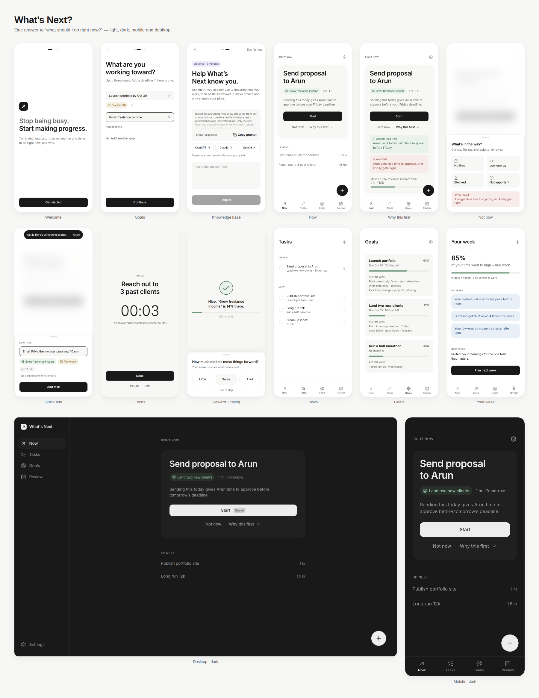

# What's Next?

**An AI task prioritizer that answers one question better than any other tool: _what should I do right now?_**



People can list their tasks anywhere. The failure happens at the moment of action: we pick the easy, low-value task because it feels productive, and end the day busy with no meaningful progress. What's Next shows **one** task, says **why** in one sentence, and makes that task the easiest thing to start.

---

## Run it

```bash
npm install
npm run dev          # http://localhost:5173
```

The app is local-first and fully usable with **no keys and no backend**. The built-in prioritization engine answers instantly; everything is stored on the device.

### Turn on Claude (optional)

```bash
cp .env.example .env.local
# ANTHROPIC_API_KEY=sk-ant-...
npm run dev
```

The Vite dev server exposes `/api/ai`, which calls Claude server-side. The key never reaches the browser. With AI on you get cleaner parsing, a judgment of real impact per task, and reasons written for your exact situation, streamed in token by token. If the model is slow or unavailable, the local engine's answer stands.

### Supabase: auth, database, sync, production AI (optional)

1. Create a project, then apply the schema: `supabase db push` (or run `supabase/migrations/20260924000000_init.sql` in the SQL editor).
2. Enable **Anonymous sign-ins** (Authentication → Providers), so people can start without an account and link an email later.
3. Deploy the AI function and its secret:
   ```bash
   supabase functions deploy ai
   supabase secrets set ANTHROPIC_API_KEY=sk-ant-...   # optional: AI_MODEL, ALLOWED_ORIGIN
   ```
4. Set `VITE_SUPABASE_URL` and `VITE_SUPABASE_ANON_KEY` in `.env.local` and rebuild.

Tables: `users`, `goals`, `tasks`, `task_ratings`, `skip_reasons`, `knowledge_base`. All use row level security, so each person only ever reads and writes their own rows. Sync is diff-based and local-first: undo and offline edits simply become the next diff.

### Scripts

| | |
|---|---|
| `npm run dev` | Dev server with the AI route |
| `npm run build` | Typecheck and production build |
| `npm test` | Engine unit tests (parsing, scoring, reasons, rewards, knowledge base) |

---

## How it decides

`src/engine/score.ts` blends seven factors, each scored 0–1:

| Factor | Weight | What it measures |
|---|---|---|
| Impact on goals | 0.30 | Linked goal, goal rank and deadline, learned goal affinity, Claude's impact judgment |
| Deadline urgency | 0.22 | Slack before the deadline; handoffs to other people get a day of lead time |
| Unblocking | 0.13 | How many open tasks wait on this one |
| Effort vs. time | 0.10 | Fits the time left today, or the time you said you have |
| Energy | 0.08 | Your capacity at this hour vs. the task's demand, learned from ratings and "Low energy" taps |
| Past ratings | 0.09 | How much similar tasks moved things for you |
| Knowledge base | 0.08 | High-value work, avoidance patterns and busywork from your profile |

**Observed behavior overrides imported claims.** The knowledge base weight shrinks as ratings accumulate, and its share moves to ratings.

**"Not now" adjusts the very next pick.**
- *No time*: prefers tasks that fit in half the time.
- *Low energy*: prefers light work for two hours.
- *Blocked*: waits until tomorrow.
- *Not important*: lowers impact and nudges the goal's weight down.

**Manual reordering is respected** through a per-task bias. The engine says once if it disagrees ("I'd still keep 'Send proposal' close, since it's due Friday").

**Every task gets:**
- a bucket: Do now, Next, Later or Probably skip
- a one-sentence reason
- an "if you do it now" outcome
- an "if you wait" cost

Reasons are chosen by what actually drives the score, for example "Sending this today gives Arun time to approve before your Friday deadline" or "You mentioned you tend to put off outreach. This is the one to do first."

**Goal progress** is effort-weighted and keeps honest room for work nobody has written down yet. Finishing every listed task gets a goal close to done; only you mark it achieved.

## The loop

- **Trigger.** Opening the app answers the question immediately. There is an optional morning notification ("Your first task today is ready"), and after 30+ minutes away the card says "Welcome back".
- **Action.** One focus card with Start as the only primary button. Adding a task is one field: `send proposal to Arun by Friday, 1 hr` becomes a title, a deadline, an effort estimate, a person and a linked goal.
- **Variable reward.** After finishing, you see one of: goal progress animating, tasks unblocked, a personal insight, pace, momentum or deadline relief. The same kind never repeats twice in a row.
- **Investment.** "How much did this move things forward?" (Little / Some / A lot). In the evening: "Tomorrow starts with X. Sound right?"

## Design system

Tokens live in `src/styles.css` as CSS variables and are exposed to Tailwind v4 through `@theme`. The type scale, weights, radii and palette are closed sets: anything outside them doesn't exist as a utility.

- **Color:** black and white carry the interface; five pastel accents carry meaning only.
  - Sage: progress and success
  - Sky: AI insight
  - Sand: time
  - Blush: cost of delay
  - Lavender: personalization
- **Motion:** Framer Motion. The easing is `cubic-bezier(0.32, 0.72, 0, 1)` at 200–350ms; springs are used for layout. Sequences:
  - The focus card scales in on load.
  - The task title travels from the card into Focus mode.
  - Completion: the checkmark draws itself, then the goal bar fills, then the next task rises.
  - `prefers-reduced-motion` reduces everything to fades.
- **Hierarchy:** one hero and one primary action per screen, three text levels, at most two accents visible.
- **Accessibility:** WCAG AA contrast in both themes (verified with axe), full keyboard use, 44px touch targets, and focus trapping in sheets.

> **Tertiary text.** `#A3A3A3` measures 2.5:1 on white, which fails AA for small text. It is used for placeholders, disabled states and decorative marks. Tertiary *text* uses `#707070` (4.6:1 on the surface color). The variable is `--text-tertiary` if you prefer the lighter tone.

### Keyboard

| Key | |
|---|---|
| `N` | New task |
| `Space` | Start the focused task (Pause / Resume in Focus mode) |
| `Enter` | Complete the focused task |
| `1` `2` `3` | Rate after finishing |
| `Esc` | Close a sheet, or exit Focus mode |
| `↑` `↓` on a drag handle | Reorder tasks |

Every change can be undone for five seconds from the toast.

## Project layout

```
src/
  engine/      prioritization, parsing, reasons, rewards, insights (pure, unit tested)
  ai/          streaming client + orchestration (refine parsing, rank, profile signals)
  store/       zustand state (persisted locally), undo, selectors
  design/      component library: Button, Pill, Field, Sheet, Toast, ProgressBar, …
  components/  app pieces: QuickAdd, TaskDetail, Completion, ProfileCards, Nav, …
  screens/     Onboarding, Now, Focus, Tasks, Goals, Review, Settings, Knowledge
  data/        Supabase client and sync
server/        Vite dev middleware for /api/ai
supabase/      schema migration and the `ai` Edge Function (prompts in _shared/ai.ts)
```

The default model is `claude-opus-5` (override with `AI_MODEL`). Requests use low effort for snappy judgments, and the server-side refusal fallback is enabled.
